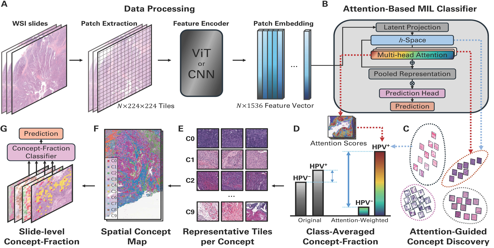

# CLEAR-HPV  
**Concept-Level Explainable Attention-Guided Representation for HPV-Associated Whole-Slide Histopathology**

---

<p align="center">
  
</p>

---

## Overview

**CLEAR-HPV** is a concept-level interpretability framework for attention-based multiple instance learning (MIL) models applied to HPV-associated whole-slide histopathology.  
The method discovers **unsupervised, morphologically coherent concepts** in the attention-structured latent space of MIL models and represents each slide using compact **concept-fraction vectors**, enabling both high predictive performance and biological interpretability.

CLEAR-HPV is **annotation-free**, model-agnostic, and compatible with common MIL backbones such as CLAM, ABMIL, and TransMIL.

---

## Key Contributions

- **Concept discovery in MIL latent space (`h`-space)**  
  Clusters attention-structured tile embeddings into interpretable morphologic concepts.

- **Concept-fraction slide representations**  
  Summarizes each whole-slide image as a low-dimensional vector describing its morphologic composition.

- **Spatial concept maps**  
  Produces interpretable spatial overlays highlighting concept localization within WSIs.

- **Cross-cohort generalization**  
  Concepts discovered on one cohort transfer consistently to unseen datasets.

- **Model-agnostic design**  
  Works with arbitrary attention-based MIL architectures without architectural modification.

---

## Method Summary

1. **MIL Backbone**  
   A standard attention-based MIL model (e.g., CLAM) produces:
   - tile embeddings `h_i`
   - attention scores `α_i`

2. **Concept Discovery**  
   Tile embeddings are clustered in `h`-space (raw or attention-weighted) to discover `K` morphologic concepts.

3. **Concept Assignment**  
   Each tile is assigned to a concept based on proximity to learned centroids.

4. **Concept-Fraction Vectors**  
   Each slide is represented as a `K`-dimensional vector summarizing concept prevalence.

5. **Interpretability Outputs**
   - Representative tiles per concept
   - Spatial concept maps
   - Slide-level concept profiles

---

## Feature Extraction with CLAM

CLEAR-HPV uses **CLAM (Clustering-constrained Attention MIL)** as the feature extraction backbone to obtain tile-level embeddings from whole-slide images (WSIs). CLAM provides a standardized and widely adopted pipeline for WSI tiling, feature encoding, and attention-based aggregation, enabling reproducible downstream concept discovery.

### WSI Tiling

Whole-slide images are tiled into fixed-size patches at a predefined magnification level following the standard CLAM preprocessing pipeline. Tiles corresponding to background or low tissue content are filtered prior to feature extraction.

### Encoder Feature Extraction

Each tile is encoded using a pretrained convolutional or vision transformer encoder (e.g., ResNet-50, UNI, UNI2). The encoder outputs a fixed-dimensional feature vector for each tile.

All tile features are stored in **HDF5 (`.h5`) files**, along with their spatial coordinates, following the CLAM convention:
- `features`: tile-level embeddings
- `coords`: (x, y) coordinates of each tile in the WSI

### Example: Extracting Features with CLAM

```bash
python extract_features.py \
  --data_h5_dir /path/to/wsi_h5 \
  --data_slide_dir /path/to/wsi \
  --csv_path slides.csv \
  --feat_dir features/h5_files \
  --batch_size 256 \
  --encoder UNI2

